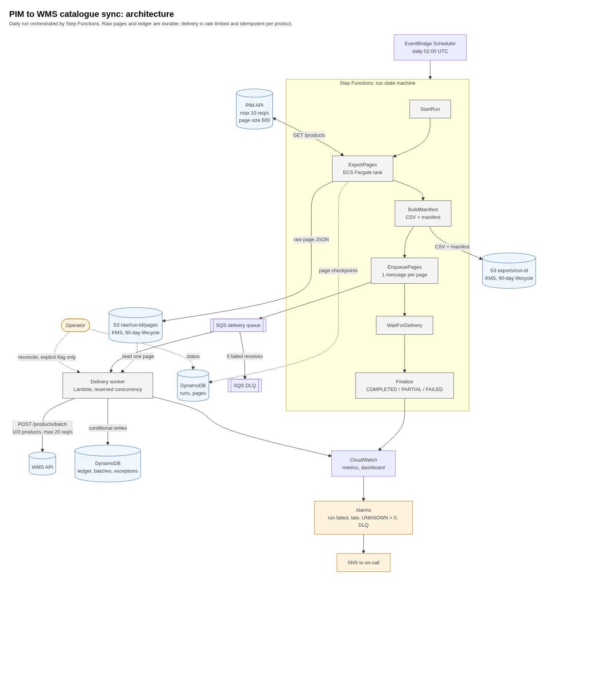

# Architecture: PIM → WMS Daily Catalogue Sync

This document describes the **target** architecture and the reasoning behind it. Where the local implementation differs from the target, `UNFINISHED.md` says so.

---


## 1. Problem in one paragraph

Every morning the catalogue is copied from the PIM (paginated, 10 req/s, page size ≤ 500, transient 429/5xx) into the WMS (batches ≤ 100, 20 req/s, per-record business rejections, no idempotency key). The catalogue is ~250k products now and ~1M within 18 months. The run must normally finish within 30 minutes, must recover from transient failures without manual steps, must never send the same product twice, must keep the raw export for 90 days, and must let operations tell whether a run is running, completed, or failed.

## 2. Capacity arithmetic (drives every other decision)

| Quantity | Value | Consequence |
|---|---|---|
| PIM max throughput | 10 req/s × 500 = 5,000 products/s | 1M products ≥ 200 s of pure fetch time |
| WMS max throughput | 20 req/s × 100 = 2,000 products/s | 1M products ≥ 500 s of pure delivery time |
| 30-minute budget | 1,800 s | Delivery at 1M uses ~28% of the budget at the WMS rate limit; at 250k it uses ~7% |
| Mean PIM latency | 100 ms – 3 s | At 10 req/s and 3 s latency, ~30 requests must be in flight to keep the limit saturated |
| Mean WMS latency | "varies significantly" | Same reasoning; bounded concurrency is needed to hide latency |

Two consequences:

1. **Rate limiting must be a shared, process-wide token bucket**, not `time.sleep` in each worker. Otherwise N workers each believe they own 10 req/s.
2. **Retries consume the budget.** A 429 costs a request slot. The retry policy must be bounded and must not re-fetch or re-send work that already succeeded, or the 30-minute target is lost at 1M.

At 1M products, the theoretical floor is ~8–9 minutes. The 30-minute target therefore tolerates roughly 3× slowdown from throttling and latency. That is the design margin.

## 3. Architecture at a glance



*Rendered from [`docs/architecture.mmd`](docs/architecture.mmd) (Mermaid source; open [`docs/architecture.html`](docs/architecture.html) in a browser to re-render). The three planes are: control (EventBridge, Step Functions), extraction (PIM to S3), and delivery (SQS, worker, WMS, DynamoDB ledger).*

**Read the diagram as three planes:**

- **Control plane**: EventBridge and Step Functions. Owns run lifecycle, ordering, timeouts, and final status. Holds no product data.
- **Extraction plane**: PIM page fetcher writes immutable raw pages to S3. Its output is durable before any delivery begins.
- **Delivery plane**: SQS-fed workers send batches to WMS, rate-limited, and record the outcome of every SKU in a ledger.

The planes communicate only through S3 objects, DynamoDB rows, and SQS messages. No plane calls into another's memory. This is what makes each one independently retryable.

## 4. Components

| Component | Responsibility | Why this shape |
|---|---|---|
| **EventBridge schedule** | Triggers one run per day. | Native, no server to run. |
| **Step Functions (Standard)** | Owns the run state machine: stages, timeouts, retries of whole stages, final status. | Gives a visual execution history for operators, which answers "is it running, done, or failed?" without custom tooling. Standard (not Express) because runs last up to ~1 hour and need durable history. |
| **Page fetcher** (one ECS Fargate task) | Fetches every PIM page with a bounded thread pool, writes each raw page to S3, checkpoints each one in DynamoDB. | Idempotent per page: a page already stored is skipped. A single task also means the PIM token bucket is exact rather than divided (§7). |
| **S3 `raw/{run_id}/pages/`** | Immutable copy of every PIM page as received. | Replay source if transformation or delivery is wrong. Retained 90 days. |
| **S3 `exports/{run_id}/`** | `catalogue.csv` assembled from the raw pages, plus `manifest.json` (page count, product count, PIM-reported total, SHA-256 of CSV). | Keeps the existing CSV contract that downstream tooling expects. The manifest is the completeness check. |
| **DynamoDB `runs`** | One item per run: status, stage, counters, timestamps, `schema_version`. | Operators query it; the status command reads it. |
| **DynamoDB `pages`** | One item per `(run_id, page)`: status, product count, checksum, object key. | A resume re-fetches only pages that are missing or failed. |
| **SQS batch queue + DLQ** | Carries batch descriptors `(run_id, batch_no, sku_range or key list)`. | Decouples delivery rate from fetch speed. Visibility timeout > worst-case batch duration. DLQ catches poison messages. |
| **Delivery worker** (Lambda or ECS) | Reads a batch, applies WMS rate limiting, POSTs to WMS, interprets partial success, updates the ledger. | Concurrency limited by reserved concurrency (Lambda) or service desired count (ECS), sized so that `workers × 100 products / latency ≤ 2,000/s`. |
| **DynamoDB `ledger`** | One item per product per run: state, batch_no, attempt count, last reason, content hash. | The duplicate-protection record. Conditional writes make state transitions monotonic. Keyed by the single hash key `"<run_id>#<sku>"`, **not** `(run_id, sku)`: a composite key would send a million writes to one partition, which is capped at 1,000 WCU/s and would throttle delivery. Access is point read/write only, and `BatchGetItem`'s 100-key limit happens to match one WMS batch exactly. |
| **DynamoDB `exceptions`** | Only rejected, unknown and locally-invalid products, keyed `(run_id, sku)`. | Aggregates come from counters on the run item, so nothing ever scans the ledger. This small, sparse table is what lets operations list "everything that went wrong in this run" with one query instead of a global secondary index over a million items. |
| **CloudWatch** | Custom metrics, dashboard, alarms → SNS. | Standard, zero infrastructure. |

### Why Step Functions *and* SQS

Step Functions manages the **run** (a few dozen state transitions). SQS manages the **work** (~10,000 batch messages at 1M products). Putting 10,000 batches into a state machine's history would hit its limits and make the execution unreadable. Putting the run lifecycle into SQS would lose ordering and the operator view. Each tool does the job it is built for.

## 5. Execution flow

1. **StartRun**: create the run record with status `RUNNING`. The `run_id` is a UTC timestamp plus a short random suffix (`20261005T0931Z-3f9c`), so runs sort chronologically, a run is tied to its business date, and a manual re-run never collides with the scheduled one. Creation is a conditional write, so the same id cannot be started twice; the CLI says to use `resume` instead.
2. **ExportPages**: a single ECS task (`ecs:runTask.sync`, so the state machine waits rather than polls) fetches every page with a bounded thread pool. For each page it skips the fetch if the page is already recorded `COMPLETE` **and** still present in S3, otherwise it fetches, writes the raw page, and only then records the checkpoint. Writing storage before the checkpoint is deliberate: a crash in between makes the page look unfetched and it is simply fetched again, whereas the reverse order could mark a page complete that is not in storage.
   The page count is not known in advance. Page 1 is fetched first because its response carries `total`, from which `N = ceil(total / page_size)` follows.
3. **BuildManifest**: the same task then streams the stored pages in order into `exports/{run_id}/catalogue.csv` and writes `manifest.json` with the row count, the PIM's reported total, the SHA-256 of the CSV, and the list of failed pages. The manifest is the completeness record: `complete` is false when a page is missing or the row count does not match, and the run is reported `PARTIAL` rather than silently short.
4. **EnqueuePages**: sends **one SQS message per stored raw page**, not per batch. A page message is a few bytes and the worker reads one small object; a batch message would otherwise have to carry a row range into a CSV that is hundreds of megabytes at a million products. Each page of 500 products becomes five WMS batches of 100 inside the worker, and the batch numbers are derived from the page's global row offset so they are identical to the numbers the local CSV-streaming path produces. That identity is what lets both execution models share one ledger and one batch table; it holds because the PIM only ever returns a short page as the last page. A re-enqueue is harmless: the ledger and `claim_batch`, not the queue, decide what may be sent.
5. **WaitForDelivery**: a `Wait` state plus a check function, looping until no batch is left `PENDING`, `SENDING` or `FAILED_TRANSIENT`, bounded by the state machine timeout.
6. **Finalize**: `COMPLETED` when every product reached a definite outcome; `PARTIAL` when anything is missing or ambiguous (failed pages, failed batches, any `UNKNOWN`, or an incomplete export); `FAILED` when no usable export was produced. Business rejections are always reported but do not by themselves make a run unsuccessful — the warehouse told us exactly what it thinks of those products.
7. **Reconcile** is **not** part of the scheduled flow. It is an operator command that resends only `UNKNOWN` products, and only with explicit confirmation, because it is the one operation that can create a real duplicate (§8).

### Data flow

```
PIM /products ──► raw page JSON ──► S3 raw/{run}/pages/000001.json …
                                         │
                                         ▼
                        CSV + manifest ──► S3 exports/{run}/catalogue.csv, manifest.json
                                         │
                                         ▼
                    SQS batch messages ──► worker ──► WMS /products/batch
                                         │
                                         ▼
                      DynamoDB ledger: PENDING → SENT → ACCEPTED | REJECTED | UNKNOWN
```

The CSV is a **view** of the raw pages. The raw pages are the source of truth. This is deliberate: if the transform changes, we re-derive the CSV without re-calling the PIM.

## 6. Failure and retry flow

### Error classes and handling

| Observed outcome | Class | Action |
|---|---|---|
| PIM 429 | Known, transient, not processed | Wait `Retry-After` if present, else exponential backoff with full jitter. Return the token to the bucket only after the wait. |
| PIM 5xx, timeout | Known-or-unknown; reads are safe to repeat | Retry the page. Reads have no side effects, so a repeat cannot double anything. |
| PIM 4xx other than 429 (e.g. 401, 400) | Permanent | Fail the page immediately, no retry. A 401 fails the whole run, because it means a configuration problem. |
| WMS 429 | Known, not processed | Same backoff. Ledger state does not change. |
| WMS 503 | Known to be a server rejection | Same backoff. The current docs do not say whether 503 means "not processed"; see the duplicate analysis in §8 for how this is handled. |
| WMS 400, 413 | Permanent, not processed | Do not retry. Mark the batch's items `FAILED_VALIDATION` and surface them. This is a bug in our payload, not a transient issue. |
| WMS 200 with `accepted` + `rejected` | Partial success | Mark `accepted` SKUs `ACCEPTED`, `rejected` SKUs `REJECTED` with reason. **Never retry accepted items.** Rejects are not retried automatically; they need a data fix. |
| WMS 200 but a SKU appears in neither list | Ambiguous | Mark `UNKNOWN`. Do not treat as accepted. |
| WMS timeout or connection reset after the request was sent | **Ambiguous** | Mark the batch's still-`SENT` items `UNKNOWN`. Do not auto-resend. See §8. |
| Worker crash mid-batch | Ambiguous | SQS redelivers. Items already `ACCEPTED`/`REJECTED` are skipped by the ledger; items `SENT` without an outcome become `UNKNOWN` after the visibility timeout. |

### Retry policy (applies to both APIs)

- Exponential backoff with **full jitter**: `sleep = random(0, min(cap, base × 2^attempt))`, `base = 0.5 s`, `cap = 30 s`, `max_attempts = 6` per request.
- `Retry-After` overrides the computed sleep if it is larger.
- Retries happen **inside** the request loop, so the rate limiter sees each attempt as one token.
- After `max_attempts`, the page or batch is marked failed for this attempt. The message goes back to SQS (with a visibility delay), up to `maxReceiveCount = 5`, then to the DLQ.

Why full jitter: with a deterministic mock failing on every 11th and 13th request, synchronised backoff would cause thundering-herd retries at the same moment. Jitter spreads them.

### A note on the supplied mocks

Both mock services intend to return 429 and 503 but construct `JSONResponse(429, {...})` with the status and body transposed, so their throttling paths actually surface as **HTTP 500 with no `Retry-After` header**. The mocks are part of the test environment and were not modified. Two consequences, both deliberate:

- the client treats the whole 5xx family as "not processed, retry", which is also the documented behaviour of the real APIs, so it copes with either;
- `Retry-After` handling cannot be exercised against the mock, so it is covered by unit tests with an injected transport ([`tests/test_product_api.py`](tests/test_product_api.py)).

This is worth stating because it changes what the local run proves: it proves the retry path, not the throttling-specific path.

## 7. Scaling and rate limiting

### Rate limits

A token bucket ([`app/clients/rate_limiter.py`](app/clients/rate_limiter.py)) is shared by every thread that talks to a given API: 10 tokens/s for the PIM, 20 for the WMS, burst equal to the rate. A caller that finds the bucket empty takes its slot anyway (the balance goes negative) and waits for its own deficit, which keeps the long-run rate exact and serves callers in arrival order instead of waking them all at once.

Two properties matter and are tested with an injected clock:

- **Every attempt takes a token, including retries.** A retry is a request; if it bypassed the bucket, a throttled run would breach the limit exactly when the API is already complaining.
- **One bucket per API, not per worker.** Eight fetcher threads sleeping `1/rate` each would produce eight times the allowed rate. The original script's fixed `time.sleep(1)` retry would have become this bug as soon as it ran with concurrency.

**In AWS the budget is divided, not shared.** The exporter is a single ECS task, so its in-process bucket is the whole PIM budget and is exact. The delivery workers are separate Lambda invocations that cannot see each other, so Terraform gives each one `wms_requests_per_second / delivery_worker_concurrency` and caps reserved concurrency; the fleet therefore stays inside 20 req/s, at the cost of under-using the budget when fewer workers are active. A genuinely shared distributed limiter (a DynamoDB token bucket with short leases) is the next step and is listed in [UNFINISHED.md](UNFINISHED.md); it is not implemented, so this document does not claim it.

Delivery concurrency is deliberately not the control: at 3 s WMS latency roughly 60 in-flight requests would be needed to saturate 20 req/s, so the limiter binds first and concurrency only decides how much of the budget is reachable.

### Scaling 250k → 1M

| Stage | 250k | 1M | Bottleneck |
|---|---|---|---|
| Fetch | 500 pages ≈ 50 s at 10 rps | 2,000 pages ≈ 200 s | PIM rate limit |
| CSV build | streamed, seconds | streamed, minutes at most | S3 read throughput, not a constraint |
| Delivery | 2,500 batches ≈ 125 s | 10,000 batches ≈ 500 s | WMS rate limit |
| Total (ideal) | ~3 min | ~12 min | |
| Total with throttling and retries (assume 20% overhead) | ~4 min | ~15 min | Within 30 min |

The design scales linearly with product count because **nothing holds the whole catalogue in memory**: pages are written to S3 as they arrive, the CSV is streamed from those pages, and delivery works through a bounded in-flight window. The original script held every product in one list, which would have needed roughly 1–2 GB of Python objects at a million products and lost everything on any failure.

## 8. Partial failures and duplicate protection

This is the hardest requirement: *"The same product must never be sent twice."* We treat it as a business requirement and, as the brief asks, we do not assume its technical meaning is complete. We distinguish four cases.

### 8.1 Four cases

| # | Case | What happens | Guarantee we give |
|---|---|---|---|
| 1 | **Application-level idempotency**: the same run or re-enqueued batch is processed again | The ledger is keyed by `(run_id, sku)`. A transition `SENT → ACCEPTED` is a conditional write; a re-processed item sees a terminal state and is skipped. | **Strong.** Within our system, a SKU in a terminal state is never re-sent for the same run. |
| 2 | **Retry after a known failure** (WMS returned 429, 503, 400, or 413) | The item was not accepted. We record the attempt, and resend. For 400/413 we do not resend (payload bug). | **Strong** for 429 and 400/413 under the assumption that these mean "not processed". 503 is treated the same way, under an explicit assumption (§8.3). |
| 3 | **Ambiguous network timeout** after the request was sent | WMS may or may not have accepted the batch. We mark items `UNKNOWN` and do **not** auto-resend. | **We cannot prove the product was not sent**, but we also do not double-send. Items are visible and must be reconciled explicitly. |
| 4 | **Cross-run duplication** (tomorrow's run sends a SKU already sent today) | This is expected by the business: the catalogue is a daily full sync. It is an *update*, not a duplicate. | Requirement is ambiguous here. We assume "never twice in a run" and that WMS upserts by SKU (§10, A3). |

### 8.2 What the WMS API does and does not give us

- No idempotency key header or field.
- No documented behaviour for a repeated SKU within the same batch or across batches. The supplied mock was checked directly: sending the same SKU twice in one batch returns it twice in `accepted`, so **the WMS has no duplicate protection of its own**. Everything therefore rests on the ledger.
- No documented status for a request that timed out.
- No read endpoint, so we cannot ask the WMS what it holds.

Therefore **case 3 cannot be fully closed from our side.** The honest options:

1. **Preferred (requires WMS change)**: an `Idempotency-Key` header (`run_id:batch_no`), where the WMS stores the outcome for 24 h and returns it on a repeat. With this, case 3 becomes a safe retry and the guarantee is strong end to end. The client **already sends this header** ([`app/clients/warehouse_api.py`](app/clients/warehouse_api.py)); today the WMS ignores it, so it buys nothing, but the day the warehouse team implements it no client change is needed. Sending a header the server ignores is not a guarantee, and this document does not count it as one.
2. **Without a WMS change (implemented design)**: keep `UNKNOWN` as a visible, bounded state. Alarm on any `UNKNOWN > 0`. Provide a `reconcile` operation that re-sends only `UNKNOWN` items, and only when an operator sets an explicit flag. The residual risk is a small number of duplicated SKUs equal to the number of timed-out batches whose request actually reached WMS.
3. **Reconciliation via WMS query** (if WMS offers a read endpoint by SKU or run tag): query before resending. Not available in the mock; listed in `UNFINISHED.md`.

### 8.3 Assumptions behind the claims

- **A1**: A 429 response means the request was **not processed**. Basis: the documented semantics of 429. If false, case 2 becomes case 3 for 429s.
- **A2**: A 503 response means the request was **not processed**. This is weaker than A1 and is the first assumption to challenge with the Warehouse team.
- **A3**: Within one run, a SKU appearing in two batches is a bug and the second send is a duplicate. Across runs, a SKU update is expected.
- **A4**: A 200 response is authoritative for every SKU it names in `accepted` or `rejected`.

### 8.4 Partial success, concretely

WMS returns HTTP 200 with:

```json
{"accepted": ["P0000001", "P0000002"],
 "rejected": [{"sku": "P0000999", "reason": "Invalid warehouse product"}],
 "message": "Processed"}
```

Note that `accepted` is a list of bare strings, while `rejected` is a list of objects. The parser must handle both shapes and must not assume they cover the whole batch. Any batch SKU not in either list becomes `UNKNOWN`.

Successful products are never in the retry set. A batch of 100 with 1 rejection causes 1 ledger write to `REJECTED` and 99 to `ACCEPTED`, not a re-send of 100.

A rejection can also arrive as `{"sku": null, "reason": "sku is required"}`, which cannot be attributed to a product. Rather than guess, the client counts it, logs it and leaves the affected SKUs `UNKNOWN`; the delivery stage avoids creating these in the first place by validating every row locally before sending it, so a product with no SKU is recorded as `FAILED_VALIDATION` against its row instead of becoming an untraceable warehouse rejection.

### 8.5 How the ordering of writes makes a crash detectable

The ledger entry is written as `SENT` **before** the request goes out, which is what turns a crash into evidence:

1. `register_batch` → `claim_batch` (conditional: only `PENDING` or `FAILED_TRANSIENT` can be claimed, so a redelivered SQS message or a second worker stops here).
2. filter out SKUs already in a terminal ledger state (this is what makes a resume send only what is missing).
3. `mark_sent` the remainder.
4. send; apply the per-SKU outcome.

If the process dies between 3 and 4, the batch is left `SENDING` and its SKUs `SENT` with no outcome. On the next pass `reclaim_stale_batches` moves the batch to `UNKNOWN` and the delivery stage marks those SKUs `UNKNOWN` — never `PENDING`, because the request may already have been applied. That behaviour is tested directly in [`tests/test_warehouse_sync.py`](tests/test_warehouse_sync.py) (`test_a_batch_interrupted_mid_flight_becomes_unknown`).

## 9. AWS service choices

| Need | Service | Reason rejected alternatives |
|---|---|---|
| Schedule | EventBridge Scheduler | Cron on EC2 would need a host to operate. |
| Run orchestration | Step Functions Standard | Airflow/MWAA is heavier to operate for one daily job. Hand-rolled coordinator loses execution history. |
| Compute: export | ECS Fargate task | The export of a million products runs for minutes and must not be cut off by Lambda's 15-minute ceiling. |
| Compute: delivery and control | Lambda (container image) | Many short independent units of work; reserved concurrency is the cleanest cap on the request rate against the WMS. |
| Packaging | **One image for both**, dispatched by the entrypoint | Two artefacts would mean two builds, two scans and the possibility of the two execution paths running different code. |
| Raw and export storage | S3 with versioning, SSE-KMS, 90-day lifecycle on `raw/` and `exports/` | Required by brief. Lifecycle is enforced by bucket rule, not code. |
| Run state, page checkpoints, SKU ledger | DynamoDB on-demand | Needs conditional writes and single-digit-ms reads at ~1M keys. RDS would add connection management for no benefit. |
| Work queue | SQS standard + DLQ | Standard (not FIFO) because we enforce ordering through the ledger, and FIFO's 300 msg/s limit would throttle the 10k-batch enqueue. |
| Secrets | Secrets Manager | API keys are rotated outside the repo; never in code or tfvars. |
| Observability | CloudWatch metrics, alarms, dashboard; SNS for paging | No extra vendor. |
| Infrastructure | Terraform | Required by brief. |

## 10. Security and IAM

- **Least privilege per role**: separate roles for the exporter task, the delivery worker, the control-plane functions, the state machine and the scheduler ([`infra/terraform/iam.tf`](infra/terraform/iam.tf)). Each is scoped to specific bucket prefixes, tables and queue ARNs.
- **The split is chosen to bound mistakes**: the exporter can write `raw/` and `exports/` but cannot call the WMS or touch the ledger; the delivery worker can read `raw/` and write the ledger but has **no S3 write permission at all**, so a bug in delivery cannot corrupt the 90-day export. No role is granted `s3:DeleteObject` — retention is a lifecycle rule, not an application capability.
- **Secrets**: PIM and WMS API keys live in Secrets Manager. Workers read them at cold start with an IAM condition on the secret ARN. Keys are never in environment variables in plain text, never in Terraform state (we reference the secret, not the value), and never in the repo. `.gitignore` already excludes `.env*` and `*.tfvars`.
- **S3**: public access blocked at account and bucket level; SSE-KMS with a customer-managed key; versioning on; TLS-only bucket policy; lifecycle expiry at 90 days.
- **Data classification**: the catalogue is commercial but not personal data. No PII is in scope. Logs must not contain full product payloads; they log counts, SKUs only at `DEBUG`, and never API keys.
- **Network**: Lambdas in a VPC with NAT for outbound calls to PIM and WMS, or with a fixed egress IP if the partners allowlist IPs. VPC endpoints for S3 and DynamoDB to keep that traffic off NAT.
- **Transport**: HTTPS only to PIM and WMS; certificate verification on (httpx default).

## 11. Observability

### Metrics (CloudWatch, namespace `CatalogueSync`; no `RunId` dimension, to keep cardinality low)

- extraction: `PimRequests`, `PimRetries`, `Pim429`, `Pim5xx`, `PagesFetched`, `PagesFailed`, `PagesSkippedAlreadyStored`, `ProductsExported`
- delivery: `WmsRequests`, `WmsRetries`, `Wms429`, `Wms5xx`, `Wms413`, `WmsBatchesSent`, `BatchesSkipped`, `WmsAmbiguousOutcomes`
- outcomes: `ProductsAccepted`, `ProductsRejected`, `ProductsUnknown`, `ProductsFailedValidation`
- timing and run level: `RunDurationSeconds`, `ExportDurationSeconds`, `DeliveryDurationSeconds`, `RunsCompleted`, `RunsPartial`, `RunsFailed`

Metrics are accumulated in process and flushed once per stage, either as a plain JSON log line locally or in CloudWatch Embedded Metric Format in AWS ([`app/observability.py`](app/observability.py)), so the same counters serve both without an extra API call per metric. `PagesSkippedAlreadyStored` deserves a mention: it is how an operator sees that a resume really did avoid re-fetching work.

### Logs

- Structured JSON, one line per event, with `run_id`, `stage`, `page` or `batch_no`, `attempt`, and `outcome`.
- Correlation: the `run_id` is propagated in SQS message attributes and Step Functions input.
- Log levels: `INFO` for stage transitions and per-batch outcome counts; `WARN` for retries; `ERROR` for permanent failures. No product-level logging except SKUs for rejects and unknowns.

### Alarms

| Alarm | Condition | Why |
|---|---|---|
| Run failed | Step Functions execution `FAILED` or `TIMED_OUT` | The run did not complete. |
| Run late | No `COMPLETED` by 30 min after scheduled start | Business SLA breached. |
| Unknowns present | `ProductsUnknown > 0` at Finalize | Duplicate risk needs an operator decision. |
| Partial run | `PagesFailed > 0` or rejects above threshold | Data incomplete. Threshold to be set after a baseline. |
| DLQ depth | `ApproximateNumberOfMessagesVisible > 0` on DLQ | Poison batches. |
| Throttling pressure | `Pim429 + Wms429` above baseline for 10 min | Early warning that a partner is slowing us down. |

### Operator view

`python -m app.main status <run_id>` (local) and the Step Functions execution page (AWS) answer the brief's question: running, completed, or failed, with counts.

## 12. Important trade-offs

| Decision | Chosen | Alternative | Why | Cost of the choice |
|---|---|---|---|---|
| Keep raw pages in S3 | Yes | Stream straight to WMS | Replay, audit, and recovery without re-hitting PIM | Storage cost grows with catalogue size (raw plus CSV per day), bounded by the 90-day lifecycle; size not yet measured |
| CSV as derived view | Yes | CSV as source | Source of truth is the raw pages | Extra build step (minutes at 1M) |
| Don't auto-resend `UNKNOWN` | Yes | Auto-retry on timeout | Avoids silent duplicates | Some SKUs need an operator; residual risk until WMS idempotency exists |
| Shared DynamoDB token bucket | Yes | Per-worker sleep | Correct global rate | DynamoDB writes and a leasing scheme add complexity |
| Step Functions + SQS | Yes | SQS only, or SFN only | Run view plus unbounded work queue | Two services to understand |
| Standard SQS | Yes | FIFO | Throughput; ordering is enforced by the ledger | Duplicate deliveries possible; handled by the ledger |
| Lambda + Fargate | Yes | ECS-only | Lambda for cost and speed; Fargate for >15 min tasks | Two packaging pipelines |
| Full jitter backoff | Yes | Equal jitter or none | Spreads retries | Slightly less predictable run time |
| Reject-but-don't-retry validation failures | Yes | Retry rejects | Retrying a validation failure wastes budget and cannot succeed | Data fixes need a separate process |

## 13. Assumptions and what would change them

Each row follows the brief's four-part format: the issue, the assumption, its effect, and what changes if the assumption is wrong.

| # | Issue | Assumption | Effect | If the assumption is not valid |
|---|---|---|---|---|
| 1 | WMS duplicate guarantee is undefined | "Never twice" means never twice within one run; cross-run upsert is expected (A3) | Ledger is per run; daily updates are allowed | Scope the ledger to the SKU and content hash across runs, and add a "last delivered hash" check before every send |
| 2 | WMS 503 semantics are unknown | 503 means not processed (A2) | 503 is retried like 429 | Treat 503 like a timeout: mark `UNKNOWN`. Costs more manual reconciliation |
| 3 | No idempotency key in WMS | Cannot be added by us | Duplicate risk in ambiguous cases is bounded but not zero | Adopt the `Idempotency-Key` header (§8.2) |
| 4 | PIM `total` is stable during a run | Catalogue does not change mid-export | Pages are consistent with one `total` | Use a snapshot or `updated_since` cursor; deltas are in `UNFINISHED.md` |
| 5 | Daily full sync is acceptable | Full catalogue each day, not CDC | Simple, ~12–15 min at 1M | Move to delta sync using `updated_at` watermarks, which is the first scaling step after 1M |
| 6 | Mock behaviour is representative | Deterministic 429/503 cadence is a fair proxy | Tests use it | Real jitter and latency change tuning, not the design |
| 7 | 30-minute SLA is end-to-end | Includes fetch, build, and delivery | Stage budgets in §5 | If delivery must finish alone in 30 min, the budget still holds |
| 8 | SKU is unique and stable | `id` from PIM is the WMS SKU | Ledger keyed on SKU | Key on a composite if the WMS uses a different key |

## 14. Implementation map

Where each part of this document lives in the repository, and how much of it actually runs.

| Design element | Code | Runs locally? | Runs in AWS? |
|---|---|---|---|
| Token bucket rate limiting | [`app/clients/rate_limiter.py`](app/clients/rate_limiter.py) | Yes, exactly | Exact for the single exporter task; **divided per worker** for delivery (§7) |
| Classification, backoff, jitter, `Retry-After` | [`app/clients/retry.py`](app/clients/retry.py) | Yes | Yes |
| PIM paging | [`app/clients/product_api.py`](app/clients/product_api.py) | Yes | Yes |
| WMS batching, partial success, ambiguity | [`app/clients/warehouse_api.py`](app/clients/warehouse_api.py) | Yes | Yes |
| Page checkpoints, streamed CSV, manifest | [`app/services/catalogue_export.py`](app/services/catalogue_export.py) | Yes | Yes |
| Ledger, claim, resume, reconcile | [`app/services/warehouse_sync.py`](app/services/warehouse_sync.py) | Yes | Yes |
| Run lifecycle and final status | [`app/services/runner.py`](app/services/runner.py) | Yes (in-process stages) | Yes (Step Functions calls the same code) |
| Object storage | [`app/storage/`](app/storage/) | Local filesystem | S3 (`boto3`), tested with `moto` |
| Run state | [`app/state/`](app/state/) | SQLite | DynamoDB, tested with `moto` against the same contract suite |
| Queue fan-out | [`app/aws_handlers.py`](app/aws_handlers.py) | In-process dispatch instead | SQS |
| Infrastructure | [`infra/terraform/`](infra/terraform/) | `validate` only | Not deployed |

The local runner replaces SQS with an in-process bounded work window. That is the one structural difference between the two execution models, and it is deliberate: it keeps the repository runnable with `python -m app.main run` while the batch, ledger and claim semantics - the parts that carry the correctness guarantees - are identical in both.

## 15. What this document does not claim

- **Not exactly-once delivery.** Exactly-once needs WMS-side idempotency (§8.2, option 1). What is implemented is: at-most-once per run in the success path, no automatic resend after an ambiguous outcome, and a bounded, visible, operator-owned `UNKNOWN` state for the residual cases.
- **Not a verified 30-minute SLA at 1M products.** The arithmetic in §2 says it is achievable with roughly 3x margin, and the local run of 12,000 products completes in about 8 seconds, but the only proof is a load test against a realistic PIM and WMS. The mock catalogue is 12,000 products, so nothing here demonstrates behaviour at a million.
- **Not a globally shared rate limiter in AWS.** See §7.
- **Not deployed.** The Terraform is validated, not applied; no AWS account was used.
- Remaining gaps, with risk and priority, are in [UNFINISHED.md](UNFINISHED.md).
